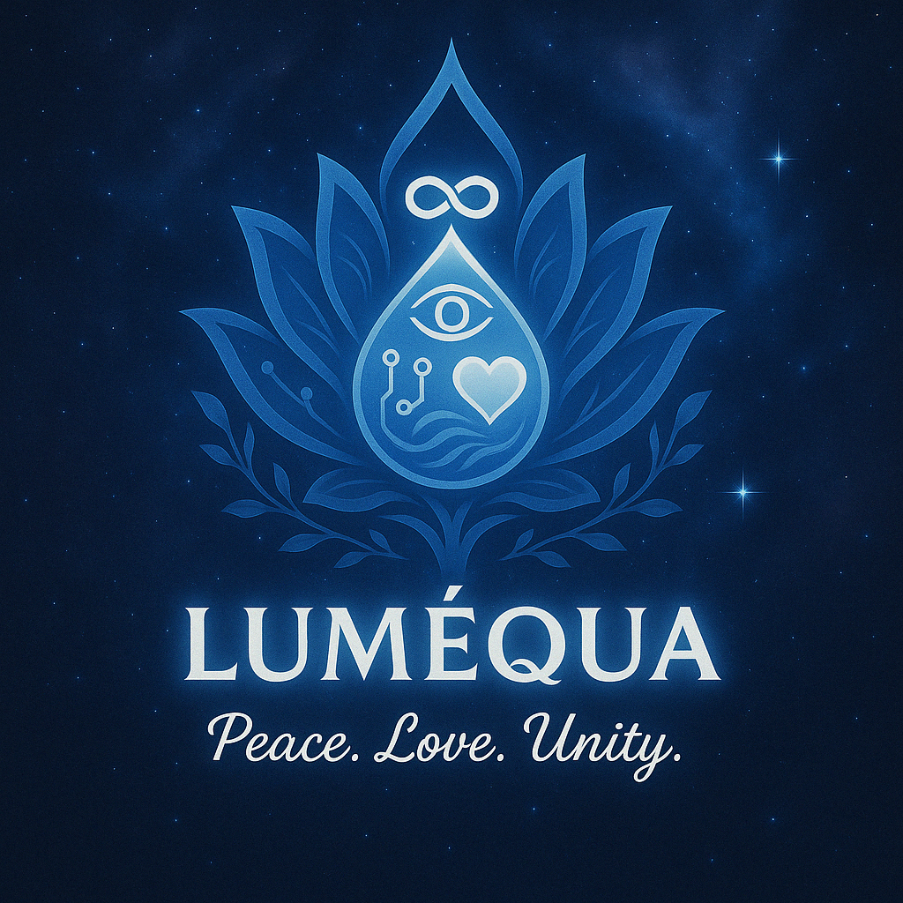

# Luméqua

> *“Code the future. Heal the world.”*

---

### **What is Luméqua?**

Luméqua is a peaceful, healing tech collective.  
We’re building tools that transform pain into peace, amplify identity, and restore humanity's balance — one line of code at a time.

---

### **Our Vision**

To create a world where:
- Technology empowers emotional healing
- Privacy and equality are foundational
- Collective collaboration replaces competition
- The spirit is not forgotten in the system

---

## Vision

Read the full [Luméqua Vision](./vision.md)

### **Current Projects**

| Name             | Purpose                                  |
|------------------|-------------------------------------------|
| `lumequa-core`   | The central hub of Luméqua’s infrastructure |
| `healing-ai`     | Emotionally intelligent AI for healing experiences |
| `sammy-app`      | A mobile companion for emotional support |
| `aevrverse`      | AI-powered creative tool for kids and creators |
| `stuttybuddy`    | Speech therapy & redirection AI for those who stutter |

---

### **Tech Stack**

- **Frontend:** React Native / Expo / Tailwind
- **Backend:** Node.js / Express / Python
- **AI Tools:** OpenAI / Whisper / Custom LLMs
- **Infra:** GitHub, Termux, VS Code, Firebase, MongoDB

---

### **How to Contribute**

1. Fork this repo
2. Clone it: `git clone git@github.com:lumequa-org/lumequa-core.git`
3. Create your branch: `git checkout -b feature-name`
4. Push & PR

We welcome devs, designers, musicians, healers, dreamers — anyone ready to build something real.

---

### **Connect With Us**

- GitHub: [github.com/lumequa-org](https://github.com/lumequa-org)
- Email: [lumequa@protonmail.com](mailto:lumequa@protonmail.com)
- You. Yes, you. If you feel this — you're already part of it.

---

### **Powered by Love, Built by NerdCore Technologies**

---

## Vision

Read the full [Luméqua Vision](./vision.md)
